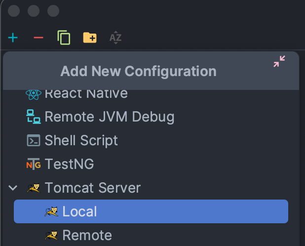
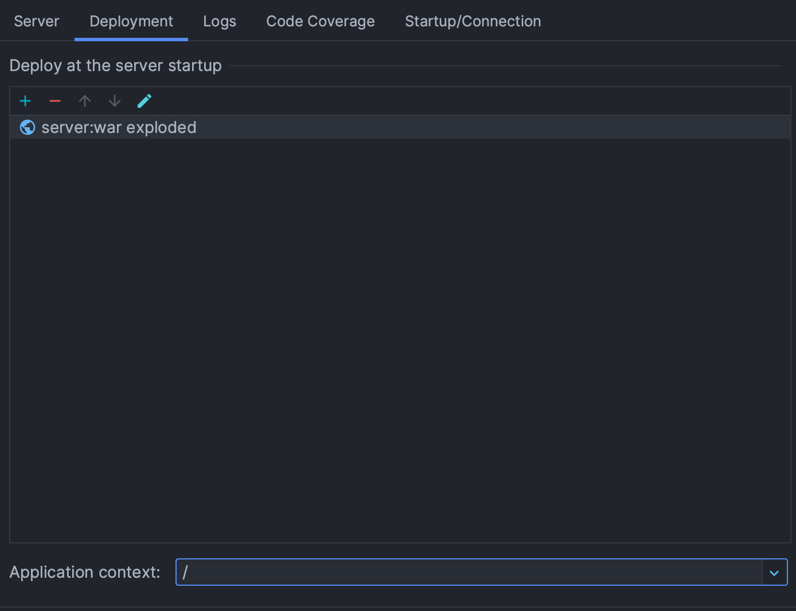
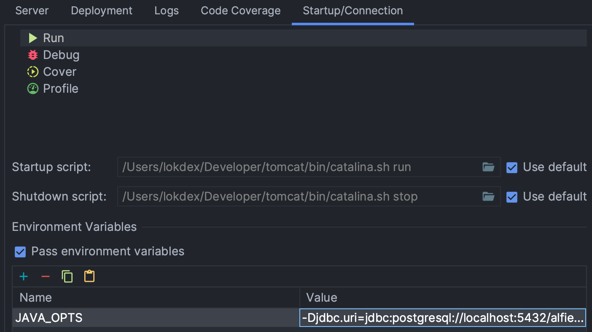

# Music Events System


Frontend Link: [Link](https://alfie-frontend.onrender.com)

Github Link: [Github](https://github.com/SWEN900072023/getters-setters)

## Table of Contents

- [Project Overview](#Overview)
- [Local Testing](#Testing)
- [Repo Structure](#Structure)
- [Team](#Team)

## 📑 Overview

This project involves creating an online event booking application that facilitates Customers in booking tickets for
live music events. The application serves one Administrator responsible for managing multiple music venues across
Australia, which host live music events. Comparable to Ticketek, Event Planners list their events on the platform, and
Customers utilize it for ticket bookings.

## Test Users

Admin User
Username: admin@mail.com
Password: Admin123

Event Planner User
Username: plan@mail.com
Password: Plan123

Customer User
Username: jdoe@mail.com
Password: Jdoe123

## 🧪 Local Environment

### 🖨️ Running the server

#### Prerequisites

* Tomcat v.10.0.27+
* Java Development Kit (JDK) v.17+
* Maven v.3.9
* PostgreSQL v.15
* Docker

#### With IntelliJ

1. Create a new Running configuration and select Tomcat from the list:
   
2. In the deployment tab, select the exploded .war as the artifact to be deployed, as well as set the path for the base
   of the web service in the bottom text input:
   
3. In the Startup/Connection tab be sure to pass the required environment variables for the sever:
   
   An example of the JAVA_OPTS environment value is the following:
   ```-Djdbc.uri=jdbc:postgresql://<db-url>/<db-name> -Djdbc.username=<username> -Djdbc.password=<password> -Dcors.origins.ui=<frontend-url> -Dcookie.domain=''```
4. Run the configuration.

#### With Tomcat scripts

1. Package the project:

```bash
cd mvn clean package -DwarName=server
```

2. Copy the generated .war file to the `webapps/` directory inside your local Tomcat installation.
3. Execute the startup script:

```bash
<tomcat-dir>/bin/startup.sh
```

The url for the backend will be as follows:
```http://localhost:8080/<package-name>/```

#### With Docker

1. Ensure that Docker is open and running on your computer.
2. Run the following command:

```bash
docker build -t <name-for-the-image> .
```

3. Once the build is finished start the server by passing the environment variables in the Docker command. For example:

```bash
docker run -p 8080:8080 -e JAVA_OPTS='-Djdbc.uri=jdbc:postgresql://host.docker.internal:5432/<db-name> -Djdbc.username=<db-username> -Djdbc.password=<db-password> -Dcors.origins.ui=http://host.docker.internal:3000' <image-name>
```

Note that for referencing services running the localhost we need to use "host.docker.internal" instead of the word "
localhost" so that the container can access it.

### 📱 Running the frontend

#### Prerequisites

Before you begin, make sure you have the following installed on your system:
- Node.js (at least version v18)
- PNPM (you can install it globally using npm install -g pnpm)

1. Navigate to frontend folder
   Open your terminal and navigate to the directory that contains the frontend client. Then execute the following
   commands

```bash
cd src/client/
```

2. Install dependencies using PNPM
   In the client directory, install the project dependencies using PNPM

```bash
pnpm install   
```

3. Start the development server
   To start the development server and launch the client with the following command,

```bash
pnpm run dev 
```

## 🗂 Project Structure

### 📝 /docs

* Holds all project documentation, including reports, diagrams and meeting minutes.

### 👩‍💻 /src

* Holds all the project source code.

#### /src/client

* Holds all of the project source code for the frontend.
* The frontend components and routes are located under /src/client/src.

#### /src/server

* Holds all of the project source code for the backend.
* The server controllers and handlers are located under /src/server/src/main/java/com/getset/alfie/server.

### The Team

| Anjaney Chirag Mahajan                                                                | Sebastian Bobadilla-Chara                                                             | Joel Fressard Kenna                                                                   | Georgia Rose Lewis                                                                    |
|---------------------------------------------------------------------------------------|---------------------------------------------------------------------------------------|---------------------------------------------------------------------------------------|---------------------------------------------------------------------------------------|
|  |  |  |  |
